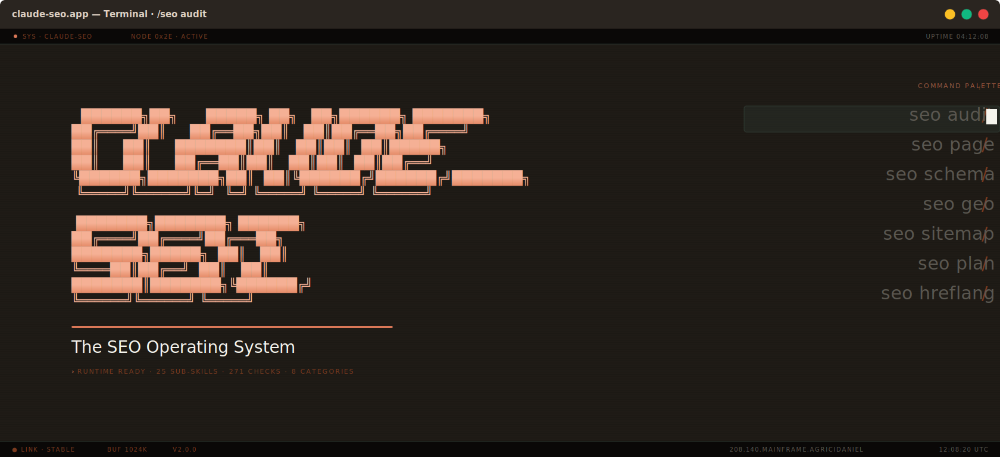
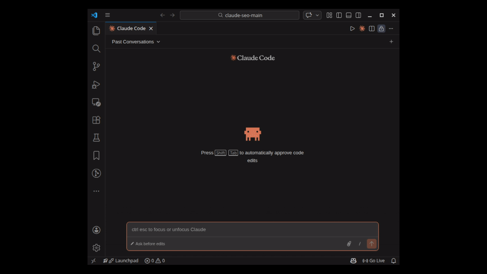
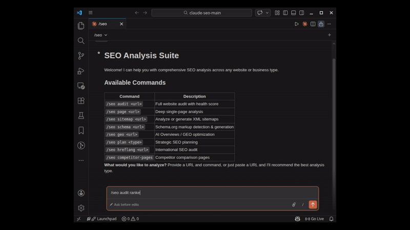
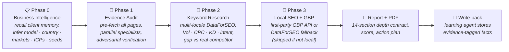
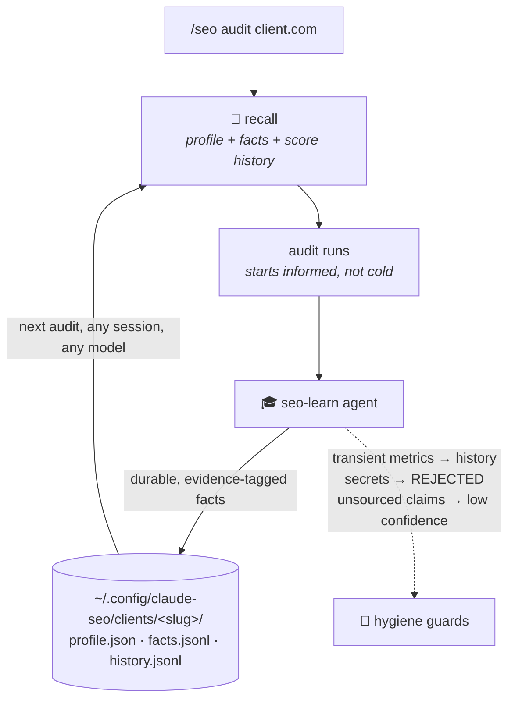
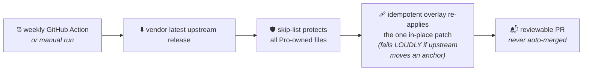
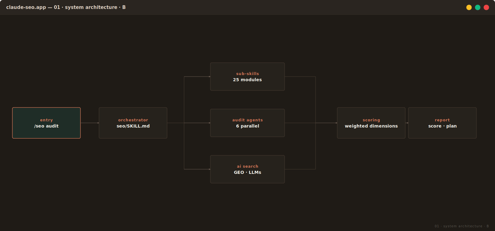
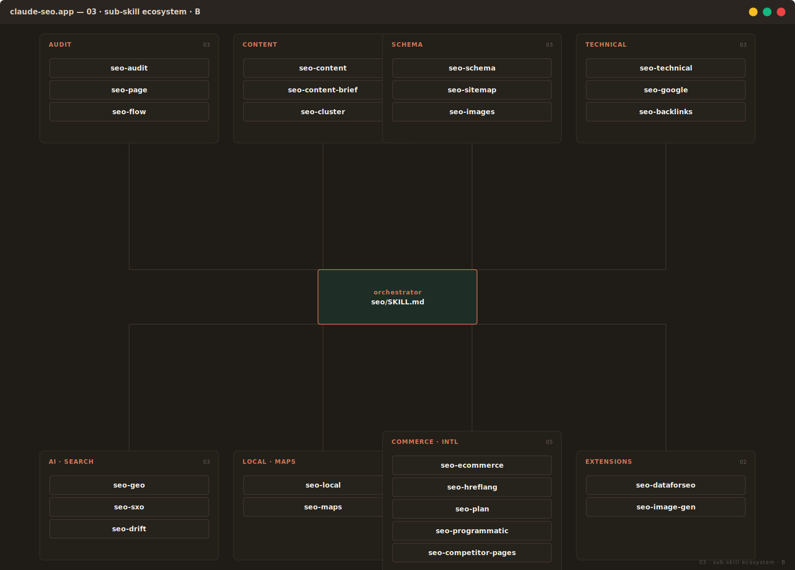

# Claude SEO Pro — the evidence-verified SEO command center

> **One SEO manager. One CLI. Enterprise-grade, client-ready audits — where every number traces to evidence, or the report says "Data pending."**

[](https://github.com/creator-imran/claude-seo-pro/actions/workflows/ci.yml)
[](LICENSE)
[](VERSION.md)
[](#-the-full-command-surface)
[](#-architecture)
[](#-verification--qa)
[](#7--the-report-depth-contract)
[](#-install)
[](NOTICE)

**Claude SEO Pro** is a hardened, client-ready distribution of the open-source [Claude SEO](https://github.com/AgricIDaniel/claude-seo) system — all 25 upstream sub-skills and 18 specialist agents preserved — plus a **Pro layer built from running real client audits**: guided API onboarding, an anti-fabrication protocol, a 4-phase audit pipeline with full keyword research, persistent client memory that survives sessions *and* model switches, cost-aware model routing, a Slack bridge, and a mandatory report-depth contract extracted from a real gold-standard client deliverable.

---

## 📜 The origin story (why "evidence-verified" is the whole point)

This distribution exists because of a real failure. An early audit for a real client shipped findings that turned out to be **fabricated**: subagents couldn't fetch the site, silently substituted *"typical patterns for sites of this type,"* and the orchestrator stripped their `[VERIFY]` caveats — promoting guesses to "Critical Issues." The client caught it.

Every Pro feature is a countermeasure born from that incident and the rebuilt audits that followed. The **Evidence Integrity Protocol** is not a slogan — it's eight enforced rules wired into the audit skill itself, and the whole system was then **battle-tested end-to-end on two real businesses** (a Dubai exhibition contractor and a US IT-staffing firm) before v1.0.0 was tagged.

---

## 📚 Table of contents

- [Why Claude SEO Pro](#-why-claude-seo-pro)
- [Who this is for](#-who-this-is-for)
- [See it run](#-see-it-run)
- [What the Pro layer adds](#-what-the-pro-layer-adds)
  - [Guided onboarding](#1--guided-onboarding-seo-setup)
  - [Evidence Integrity Protocol](#2--evidence-integrity-protocol)
  - [The 4-phase audit pipeline](#3--the-4-phase-audit-pipeline)
  - [Client knowledge store + learning agent](#4--client-knowledge-store--learning-agent)
  - [Smart model routing](#5--smart-model-routing-seo-models)
  - [Slack connector](#6--slack-connector-seo-connect)
  - [The report depth contract](#7--the-report-depth-contract)
  - [Upstream sync](#8--upstream-sync-never-a-stale-fork)
  - [Quality & release engineering](#9--quality--release-engineering-new-in-110)
  - [Claude ↔ OpenRouter switching](#10--claude--openrouter-switching-new-in-120)
- [Install](#-install)
- [First-run onboarding](#-first-run-onboarding)
- [Quick start](#-quick-start)
- [The full command surface](#-the-full-command-surface)
- [Sample output](#-sample-output-from-a-real-audit)
- [Compared to the alternatives](#-compared-to-the-alternatives)
- [Architecture](#-architecture)
- [Security](#-security)
- [Verification & QA](#-verification--qa)
- [Limitations](#-limitations-honest-ones)
- [Documentation](#-documentation)
- [FAQ](#-faq)
- [Versioning & provenance](#-versioning--provenance)
- [Credits & license](#-credits--license)

---

## 🎯 Why Claude SEO Pro

| | Upstream `claude-seo` | **Claude SEO Pro** |
|---|---|---|
| SEO sub-skills | 25 | 25 **+ 5 Pro** = 30 |
| Specialist agents | 18 | 18 **+ 1 learning agent** = 19 |
| API onboarding | per-extension shell scripts | **guided wizard**, 7 providers, live validation, owner-only storage |
| Anti-fabrication | "do not guess" guidance | **enforced 8-rule protocol** (pre-fetch, cite-or-pending, caveat preservation) |
| Full-audit shape | parallel specialists → report | **4 phases**: business intelligence → audit → keyword research → local/GBP |
| Keyword research | via DataForSEO extension commands | **built into every audit** — multi-locale Vol/CPC/KD/intent + opportunity tiers |
| Client memory | per-session | **persistent knowledge store** — survives sessions *and* model switches |
| Model cost control | implicit | **dispatch-time router** — Haiku extraction / Sonnet reasoning / Opus synthesis |
| Chat interface | — | **Slack bridge** → headless audits (`/seo audit client.com` from Slack) |
| Report depth | varies by run | **contractual** — 14 mandatory sections, gold-standard template, PDF deliverable |
| Staying current | you re-clone | **weekly CI sync → reviewable PR**, overlay re-applied automatically |

Three principles run through all of it:

1. **🔍 Evidence or "Data pending" — never guesses.** Every number in a report traces to a captured file:line or a saved API response field. A blocked API yields an honest pending section with the exact error code and the unlock step.
2. **🔐 Secrets stay on your machine.** Keys live in `~/.config/claude-seo/` (owner-only), never in the repo, never in chat, never sent anywhere but the provider's own endpoint.
3. **🧠 The system gets smarter per client.** Every audit reads the client's knowledge store first and writes evidence-tagged facts back after — audit #2 starts informed, not cold.

---

## 👥 Who this is for

- **🏢 In-house SEO managers** — supercharge your workflow with Claude without standing up infrastructure: install, `/seo-setup`, audit. The [User Manual (PDF)](manual/Claude-SEO-Pro-User-Manual-v02.pdf) assumes zero coding background.
- **🏪 Agencies & consultants** — ship a repeatable, white-label-able audit system to clients one seat at a time, with credentials kept on each client's own machine and a client-grade PDF at the end of every run.
- **🤝 Teams that answer to skeptical stakeholders** — every recommendation carries its evidence, every report carries its API call log, and pending data is disclosed instead of papered over. Built for the moment a client asks *"how do you know?"*

---

## 🎬 See it run

The command surface is preserved from upstream — these demos show the exact UX you get *(captures from the upstream project; same commands here)*:



A full audit fans specialist agents out in parallel and converges into a prioritized, scored action plan:



---

## 🚀 What the Pro layer adds

### 1. 🧭 Guided onboarding (`/seo-setup`)

A wizard that collects, **live-validates**, securely stores, and wires up every API the system can use. Each key is checked against the provider's real endpoint *before* it's stored — a typo'd key or an IP-whitelist block is caught at setup, not three audits later.

| Provider | Unlocks | Validation behavior |
|---|---|---|
| **DataForSEO** | Rankings, full keyword research, competitors, listings, AI mentions | Detects the infamous `40207` IP-whitelist block *distinctly from* bad credentials |
| **Google API key** | Real Core Web Vitals field data (CrUX) + PageSpeed | Key proven without spending a Lighthouse run |
| **Google Search Console + GA4** *(OAuth)* | Indexation, search performance, organic traffic | **Skippable — "attach later"** marks it pending; audits degrade gracefully |
| **Google Business Profile** *(OAuth)* | First-party local insights (impressions, calls, directions) | Owner access; skippable → automatic DataForSEO public-data fallback |
| **Firecrawl** | Full-site crawling + JS rendering for SPA/large sites | Credit-balance check |
| **Exa** | Neural web search for competitor/entity research | Single 1-result probe |
| **Slack** | The chat connector (below) | `auth.test` + signing-secret format check |
| **OpenRouter** *(new in 1.2.0)* | The fallback model backend — switch when Claude credits run out, or run other frontier models (see §10) | Free `/v1/key` probe — **also shows remaining credit**. **Skippable — "attach later"** like the OAuth providers |

```bash
/seo-setup            # guided, conversational — Claude never sees your raw keys
/seo-setup verify     # status: connected / pending / not configured, per provider
```

Secrets are typed into a **masked terminal prompt** (`getpass`), never pasted into chat. Deferred OAuth providers show as `PENDING (attach later)` rather than failing audits.

---

### 2. 🛡️ Evidence Integrity Protocol

Eight rules wired into the audit skill itself (see [`skills/seo-audit/SKILL.md`](skills/seo-audit/SKILL.md)) — the anti-fabrication layer:

```text
1. Pre-fetch ALL pages in the main session → subagents read local files only
2. A failed fetch is REPORTED, never substituted with "typical patterns"
3. Every finding cites its evidence (file:line or API field) — or it doesn't ship
4. Subagent caveats ([VERIFY]/[INFERRED]) are never stripped during aggregation
5. No score without backing data — unavailable data = "Data pending", excluded, disclosed
6. Core Web Vitals use real CrUX FIELD data; lab artifacts are labelled as lab
7. Schema is read from RAW HTML (WebFetch strips <script>; some plugins emit unquoted JSON-LD)
8. What was NOT covered is reported — silent truncation reads as full coverage
```

Real-world effect: when the DataForSEO Backlinks subscription wasn't active, the report shipped a **"Backlinks: Data pending (40204 — subscription required)"** section with the activation link — instead of invented domain-rating numbers.

---

### 3. 🧠 The 4-phase audit pipeline

`/seo audit https://client.com` runs a pipeline that **understands the business before it grades the website**:



- **Phase 0** writes `business-profile.json` — business model, country of origin, detected target markets, ICPs, seed keyword themes, `is_local_business` — every field with a confidence + the evidence it rests on. Keyword research for the wrong country is worse than none.
- **Phase 2** runs the *full* DataForSEO suite across the origin **and every detected market** (e.g. UAE en/ar + KSA en/ar + Qatar en for a Gulf client), then tiers results into **quick wins / page-2-3 rescue / competitor gap / demand to capture** — with a `--plan` mode that previews the API cost before spending a cent.
- **Phase 3** uses the client's own GBP API when owner access is granted, and falls back to DataForSEO public listing data when it isn't — labelled accordingly.

---

### 4. 💾 Client knowledge store + learning agent

The Anthropic prompt cache is ephemeral and model-scoped — switch models and it's gone. So Pro adds **real persistent memory** on disk, independent of any model:



- **`/seo-knowledge recall client.com`** — what the system knows: business profile, learned facts (each with evidence + confidence + source), audit-score timeline.
- **`/seo-learn`** — the learning agent runs automatically after every audit: it distills durable business facts, **supersedes stale beliefs** (memory gets more accurate, not just bigger), and rejects transient metrics and anything secret-shaped. Preview-before-ingest, always.
- A **data cache** with TTL + provenance sits alongside it: repeat audits don't re-pay for unchanged API data, and cached numbers stay citable ("DataForSEO/ranked_keywords, cached 2026-06-06"). Expired = miss = re-fetch — no stale reads.

---

### 5. 💸 Smart model routing (`/seo-models`)

Each audit task runs on the **cheapest Claude model that does it well** — decided at dispatch time, keeping the main loop fixed (switching the main model would invalidate the prompt cache):

| Tier | Model | Used for | Example saving |
|---|---|---|---|
| extraction | Haiku 4.5 | titles/metas/status/schema-presence from pre-fetched files | 60k-token task: **$0.11 vs $0.55** on Opus |
| verification | Sonnet 4.6 | adversarial check of Critical/High findings | |
| reasoning | Sonnet 4.6 | E-E-A-T, intent, personas, fact extraction | |
| synthesis | Opus 4.8 | cross-dimension prioritization + the report | |
| orchestration | Opus 4.8 | the main loop — **pinned** | |

```bash
/seo-models                                  # inspect the policy
python .../model_router.py route --agent seo-technical    # → haiku, effort low
python .../model_router.py set --force-model opus         # flagship-report quality pass
python .../model_router.py estimate --tier extraction --in 60000 --out 10000
```

Pre-fetched evidence means even the cheap tier can't hallucinate — it's reading real files.

---

### 6. 💬 Slack connector (`/seo-connect`)

For managers who won't live in a terminal: a small webhook service that runs audits **from Slack** and posts results back.

```text
Slack: /seo audit client.com
  └─▶ HMAC signature verified (5-min replay window)      ← forged/stale requests → 401
      └─▶ command parsed + validated (URL check, enabled-commands gate)
          └─▶ user/channel authorized (DENY-BY-DEFAULT allow-list)
              └─▶ ack < 3s ("running…"), then headless `claude -p` run
                  └─▶ result posted back to the channel
```

Deny-by-default authorization (audits cost credits — nobody runs them until you allow-list them), secrets stay host-side, and the runner is transport-agnostic — a WhatsApp adapter can reuse it. Full deploy guide: [`docs/CONNECTOR.md`](docs/CONNECTOR.md).

---

### 7. 📊 The report depth contract

Every audit must produce a client-grade report meeting the **14-section depth contract** ([`report-template.md`](skills/seo-audit/references/report-template.md)) — extracted section-by-section from a real gold-standard client deliverable, with a styled [HTML skeleton](skills/seo-audit/assets/report-template.html) and a PDF as part of the deliverable:

<details>
<summary><b>The 14 mandatory sections (click to expand)</b></summary>

1. **Cover** — client, scope, method statement, version
2. **Data Integrity & Methodology** — how evidence was gathered; pending-data policy with exact error codes
3. **Executive Summary** — narrative, 4 KPI cards, score ring, full category scorecard with bars, the 5 highest-leverage moves
4. **Priority Issues** — finding *cards*: severity tag · explanation · verbatim evidence block · fix · source line
5. **What's Genuinely Strong** — mandatory; a findings-only report reads as a hit job
6. **Organic Search Visibility** — position-distribution table + ≥10-row quick-wins table (pos/vol/KD/intent)
7. **Keyword Research** — seeds-by-market table, competitor-gap table, opportunity tiers
8. **Local SEO & GBP** — field-by-field GBP table + cross-source NAP (or an explicit skip note for non-local businesses)
9. **Competitive Landscape** — classified competitor table (direct vs platforms/directories)
10. **On-Page Detail** — **one row per audited money page, all of them** — no sampling
11. **Performance** — field-vs-lab tables, culprit selectors, lab artifacts labelled
12. **Per-category detail** — Content/E-E-A-T, Schema, AI-readiness each get their own depth
13. **Prioritised Action Plan** — quick-wins + strategic tables with effort and data-backed why, sequencing
14. **Appendix** — API call log with per-call status, integrity controls, corrections vs prior report

</details>

Hard rules: a section with no data access renders as **Data pending** with the unlock step (never omitted, never estimated); every number carries a source; a compressed summary-only report is a **contract violation**.

**And the contract is machine-enforced** *(new in 1.1.0)*: `tools/lint_report.py` lints every generated report — **FAIL** on missing sections, leftover `{{placeholders}}`, or summary-only compression; warnings on depth-floor shortfalls. Validated against ground truth (the gold-depth report passes; a known-shallow report fails with 11 missing sections). A FAIL means the report doesn't ship.

**White-label** *(new in 1.1.0)*: agencies rebrand every client report — preparer, colors, logo, footer — via `~/.config/claude-seo/branding.json` (`python onboarding/branding.py set --preparer "Your Agency" --primary "#123456"`). No template editing; neutral product defaults when unset.

---

### 8. 🔄 Upstream sync (never a stale fork)

This is a vendored fork that stays current **without losing the Pro layer**:



```bash
python tools/sync_upstream.py --dry-run     # preview upstream changes (also the provenance check)
python tools/sync_upstream.py --tag vX.Y.Z  # vendor + re-apply overlay
```

A clean dry-run reports **exactly one** changed file — `skills/seo-audit/SKILL.md`, the managed overlay — proving the fork is still *upstream + overlay + owned additions*, nothing else.

---

### 9. 🧪 Quality & release engineering *(new in 1.1.0)*

The reliability layer that makes everything above safe to evolve:

| Guard | What it catches |
|---|---|
| **CI regression gate** (`.github/workflows/ci.yml` + `tests/`) | Every push/PR runs the 68-assertion adversarial component suite, compiles all 99 Python files, validates every JSON, secret-scans the tree, verifies the overlay, and self-tests the report linter. Stdlib-only, offline — no keys needed in CI. |
| **Install drift guard** (`tools/check_install.py`) | Hashes the Pro-owned surface in the repo vs what's actually installed under `~/.claude` and reports **FRESH/STALE**. Caught a real incident on first run: an audit had silently executed against stale pre-Pro skills. Installers now stamp `~/.config/claude-seo/install-manifest.json`; `/seo-setup verify` surfaces it. |
| **Report-contract linter** (`tools/lint_report.py`) | The deterministic half of the audit-quality eval harness (see §7). The LLM-judge half ships later, once calibrated — flaky judges are worse than none. |
| **Roadmap + refused-features list** (`docs/ROADMAP-7-to-9.md`) | The scope guardrail: explicitly refuses the hosted-dashboard/own-crawler/multi-tenant path that would destroy the local-first differentiation. |

---

### 10. 🔁 Claude ↔ OpenRouter switching *(new in 1.2.0)*

The system always runs on Claude Code — but the **model backend** is switchable. Out of Claude credits mid-engagement? Keep working in ~60 seconds:

```bash
# Switch to OpenRouter (default profile = the SAME Claude models, billed via OpenRouter):
python ~/.claude/skills/seo/scripts/switch_provider.py use openrouter
# then, in Claude Code:  /logout  →  exit  →  claude        (endpoint is read once at startup)

# Switch back to Claude credits:
python ~/.claude/skills/seo/scripts/switch_provider.py use anthropic
# then: restart Claude Code  →  /login
```

- **Onboarded like everything else:** the OpenRouter key is collected in `/seo-setup` (masked, validated via the free key-info endpoint, shows remaining credit) — and is **fully skippable / attach-later**.
- **Any frontier model, with guardrails:** `set-models --opus <slug> --sonnet <slug> --haiku <slug>` then `use openrouter --profile custom`. Every slug is **validated live** against OpenRouter before anything is written. Recommended: frontier-grade only (Kimi K2.6 class) — Claude Code and the Evidence Integrity Protocol are optimized for Anthropic models, and the `/seo-provider` skill says so honestly.
- **Safety:** the switcher validates the key *and* the model map live **before** touching `~/.claude/settings.json`, keeps timestamped backups (+ `restore`), merges exactly 7 env keys and nothing else, and refuses to overwrite a foreign gateway without `--force`.
- **Transparency:** every audit report's Data Integrity section states the model backend that produced it.
- `status` shows the active backend, model map, key health and remaining OpenRouter credit. Conversational: **`/seo-provider`**.

---

## 📦 Install

**Requirements:** [Claude Code CLI](https://claude.ai/claude-code) · Python 3.10+ · Node.js (only for the DataForSEO/Firecrawl/Exa MCP servers) · your own API accounts for whichever providers you enable (all optional).

**Plugin marketplace (Claude Code 1.0.33+) — fastest:**
```bash
/plugin marketplace add creator-imran/claude-seo-pro
/plugin install claude-seo-pro@creator-imran-claude-seo-pro
```
*(The repo is private — requires `gh auth login` with access. No access, or want the engines + drift guard too? Use the installer path below.)*

**Windows (PowerShell):**
```powershell
git clone https://github.com/creator-imran/claude-seo-pro.git
powershell -ExecutionPolicy Bypass -File claude-seo-pro\install.ps1
```

**macOS / Linux:**
```bash
git clone https://github.com/creator-imran/claude-seo-pro.git
bash claude-seo-pro/install.sh
```

The installer copies skills, agents, scripts, the knowledge/routing/connector engines, and the onboarding wizard into `~/.claude/`, then offers to run guided onboarding (`-NoOnboard` / `--no-onboard` to skip).

---

## 🔑 First-run onboarding

**A) In Claude Code (recommended):** `/seo-setup` — Claude explains each provider, where to get the key, and verifies the result. Secrets go into your terminal, never the chat.

**B) Directly:**
```bash
python ~/.claude/skills/seo/onboarding/setup_wizard.py            # full wizard
python ~/.claude/skills/seo/onboarding/setup_wizard.py --check    # status anytime
python ~/.claude/skills/seo/onboarding/setup_wizard.py --provider dataforseo   # one provider
```

> ⚠️ **The #1 gotcha — DataForSEO IP whitelist.** A valid key can still have every *data* call blocked (`40207`) until your machine's public IP is added at `app.dataforseo.com/api-access`. The validator detects this distinctly and tells you. On dynamic home/mobile IPs, consider disabling the whitelist — it *will* rotate on you.

---

## ⚡ Quick start

```bash
claude
/seo-setup verify                    # confirm everything is wired
/seo audit https://yourclient.com    # the full 4-phase, evidence-verified audit + PDF
/seo-knowledge recall yourclient.com # what the system remembers about this client
/seo page https://yourclient.com/    # deep single-page analysis
/seo schema https://yourclient.com   # schema detection / validation / generation
/seo geo https://yourclient.com      # AI-search / GEO readiness
```

---

## 🗂 The full command surface

5 Pro commands + the entire upstream surface (27 commands), unchanged:

| Pro command | What it does |
|---|---|
| `/seo-setup` | Guided API onboarding · verify · rotate |
| `/seo-knowledge` | Recall / remember client facts · cache stats |
| `/seo-learn <domain>` | Run a client-learning pass manually |
| `/seo-models` | Inspect / override the model-routing policy |
| `/seo-connect` | Set up & operate the Slack connector |
| `/seo-provider` | Switch model backend: Claude credits ↔ OpenRouter (status · use · set-models) |

<details>
<summary><b>All 27 upstream commands (click to expand)</b></summary>

| Command | Description |
|---|---|
| `/seo audit <url>` | Full website audit — runs the Pro 4-phase pipeline |
| `/seo page <url>` | Deep single-page analysis |
| `/seo technical <url>` | Technical SEO across 9 categories |
| `/seo content <url>` | E-E-A-T and content quality |
| `/seo schema <url>` | Detect, validate, generate Schema.org markup |
| `/seo geo <url>` | AI Overviews / GEO optimization |
| `/seo sitemap <url \| generate>` | Analyze or generate XML sitemaps |
| `/seo images <url>` | Image optimization analysis |
| `/seo plan <type>` | Strategic planning (saas, local, ecommerce, publisher, agency) |
| `/seo programmatic <url>` | Programmatic SEO analysis |
| `/seo competitor-pages <url>` | Comparison-page generation |
| `/seo local <url>` | Local SEO (GBP, citations, reviews, map pack) |
| `/seo maps [command]` | Geo-grid rank tracking, GBP audit, review intelligence |
| `/seo hreflang <url>` | International SEO / hreflang |
| `/seo google [command]` | GSC, PageSpeed, CrUX, Indexing, GA4, PDF reports |
| `/seo backlinks <url>` | Backlink profile (Moz, Bing, Common Crawl, DataForSEO) |
| `/seo cluster <keyword>` | SERP-based semantic clustering |
| `/seo sxo <url>` | Search experience optimization, persona scoring |
| `/seo drift baseline\|compare\|history <url>` | SEO drift monitoring |
| `/seo ecommerce <url>` | E-commerce + marketplace intelligence |
| `/seo content-brief <topic>` | Competitive content briefs |
| `/seo flow [stage]` | FLOW framework prompts (41, CC BY 4.0) |
| `/seo firecrawl [command] <url>` | Full-site crawling (extension) |
| `/seo dataforseo [command]` | Live SEO data (extension) |
| `/seo image-gen [use-case]` | AI image generation (extension) |
| `/seo bing`, `/seo unlighthouse`, … | Further extension mirrors |

Full reference: [`docs/COMMANDS.md`](docs/COMMANDS.md)
</details>

---

## 📄 Sample output (from a real audit)

This is the actual shape of a Pro audit deliverable — excerpted from a real production run against a live business (June 2026):

```text
BAYONE.COM — FULL SEO AUDIT · evidence-verified · 57/100
─────────────────────────────────────────────────────────
 KPIs   125 US keywords · mobile CLS 1.43 (limit 0.10) · ~200-word homepage
        · 201k/mo uncaptured "staffing agency" demand

 Scorecard   Technical 68 · Content/E-E-A-T 44 · On-Page 68 · Schema 45
             · CWV 50 · AI-Readiness 52 · Images 70 · Backlinks PENDING(40204)

 🔴 CRITICAL  Mobile CWV FAIL — field CLS 1.43 (14× limit)
              culprit: div.entry-content2 > .elementor section   [psi.json]
 🔴 CRITICAL  Authors CSS-hidden sitewide (.pix-post-meta-author{display:none})
              [4 files, line-cited]
 🔴 CRITICAL  About-page trust defects: CTO link empty; exec linked to the
              WRONG person's LinkedIn                            [about-us.html:1313,1349]
 🟠 HIGH      Money pages too thin to rank (~200 words vs 500 floor) —
              the root cause of brand-only visibility            [word counts + ranked.json]

 Competitor gap vs TEKsystems: ZERO shared non-brand staffing terms
 — the finding IS the emptiness. The field is open, not contested.
```

Every line above traces to a saved evidence file. Deliverables per audit: `FULL-AUDIT-REPORT.md`, `ACTION-PLAN.md`, the 14-section client PDF, and the knowledge-store write-back.

---

## ⚖️ Compared to the alternatives

| | Manual audit | Agency engagement | Commercial tool | **Claude SEO Pro** |
|---|---|---|---|---|
| Time per audit | 4–8 hrs senior time | 1–3 weeks | 10–45 min | **~15 min, 4 phases** |
| Cost | billable hours | $2k–$15k+ | $99–$999/mo | **skill + your API usage (audit ≈ $0.10–$3 in API calls)** |
| Evidence per finding | analyst-dependent | rarely | no | **file:line or API field, every time** |
| Honest about missing data | rarely | rarely | silently omits | **"Data pending" + exact error + unlock step** |
| Client memory across audits | analyst's head | CRM notes | no | **knowledge store + learning agent** |
| Where data lives | your spreadsheet | agency's drive | vendor cloud | **your machine, owner-only** |
| Report depth | varies | deck-dependent | dashboard | **14-section contract, PDF, enforced** |
| Lock-in | none | high | high | **none — MIT, your files** |

---

## 🏗 Architecture

The upstream 3-layer core (directive → orchestration → execution) is preserved — the orchestrator auto-discovers `skills/seo-*/` and `agents/seo-*.md`, detects the industry, fans out up to 15 specialists, and synthesizes through the 10-principle framework:





The Pro layer wraps that core with four owned engines (none of which touch upstream code):

```text
onboarding/   secure_store · providers · validate · configure_mcp · setup_wizard · gbp_auth
knowledge/    store (client memory) · cache (TTL + provenance) · learn (fact ingestion)
routing/      model_router (dispatch-time tiering)
connector/    auth (HMAC) · commands · runner (headless) · slack_bridge
```

*(Diagrams from the upstream project — the core they document is vendored verbatim.)*

---

## 🔐 Security

- **Credentials:** only in `~/.config/claude-seo/*.json` (owner-only `0600`/ACL) and `~/.claude/settings.json` for MCP servers — outside the repo, gitignored, never in chat. The wizard masks input; the skills are instructed never to echo a key.
- **Client data:** knowledge store + cache live under `~/.config/claude-seo/clients|cache/` — never committed; `.gitignore` has belt-and-suspenders patterns for every credential and client-data filename.
- **Network:** nothing transmitted anywhere except each provider's own API endpoint. No telemetry.
- **Connector:** Slack HMAC verification with replay window, deny-by-default authorization, fixed command surface, URL validation.
- **Inherited from upstream:** SSRF/DNS-rebinding-safe fetchers (`url_safety.py`), 83 bypass-class tests in the vendored suite.

Full threat model: [`docs/SECURITY.md`](docs/SECURITY.md)

---

## ✅ Verification & QA

What was actually tested before v1.0.0 (we practice the evidence rule on ourselves):

| Check | Result |
|---|---|
| Adversarial component suite (secret/transient injection, forged/stale HMAC signatures, unauthorized users, router fallbacks/overrides, cache expiry, fact-supersede) — **now in CI on every push** | **68/68 pass** |
| Repo integrity (compile-all 99 `.py` · JSON validity · secret-scan · no client data) — **in CI** | **OK / clean** |
| Inventory QA — 30 skills, 19 agents, 51 scripts, 8 extensions, doc links | **6/6 batches pass** |
| Report-linter ground-truth matrix (gold report / shallow report / raw template) | **PASS / FAIL / FAIL — exactly as designed** |
| Install drift (repo ↔ `~/.claude`) | **FRESH** |
| Provenance (sync dry-run vs upstream v2.0.0) | **exactly 1 file differs — the managed overlay** |
| **Live production runs** | full 4-phase audit on a real US business; live-data audit on a real Dubai business (28 DataForSEO calls, $0.61) — both delivered client PDFs |

Bugs found *by* this QA and fixed before release: a deprecated-`utcnow()` time bug, a silent model-router override failure, a pending-marker keying collision, a misleading signature-test artifact, a **dead-endpoint preflight in the keyword orchestrator** that aborted every live run (caught by Phase-1 validation, fixed and live-verified), and a **stale-install incident** where audits ran against outdated skills (now detectable by the drift guard). The details are in [`docs/WHATS-DIFFERENT.md`](docs/WHATS-DIFFERENT.md) — we'd rather show the bugs we caught than pretend there were none.

---

## ⚠️ Limitations (honest ones)

- **OAuth flows need a human.** GSC/GA4/GBP use browser-consent OAuth — the wizard records and guides, but you click the consent screen. Until then those sections show "Data pending."
- **DataForSEO Backlinks needs its own subscription** — without it the Backlinks section is pending (error `40204` is detected and explained, not papered over).
- **The Slack connector's live round-trip is your deploy step** — the security core (signature/auth/parsing/runner) is unit-tested offline; the end-to-end needs your Slack app + a host Claude Code can run on.
- **Inherited from upstream:** heavy client-side hydration edge cases can produce noisy findings (use `seo-visual` cross-check); zero-key mode produces local-only output with lab CWV estimates.

---

## 📖 Documentation

| Doc | What it covers |
|---|---|
| **[User Manual (v02 — HTML interactive / PDF)](manual/Claude-SEO-Pro-User-Manual-v02.html)** ([PDF](manual/Claude-SEO-Pro-User-Manual-v02.pdf)) | The exhaustive operator guide — every command with examples and expected output, all 7 provider onboardings step-by-step, the full audit walkthrough, report reading, white-labeling, troubleshooting encyclopedia, FAQ, glossary. **Start here.** |
| [VERSION.md](VERSION.md) · [system-version.json](system-version.json) | What came from upstream vs what Pro adds — the full provenance ledger + version history |
| [docs/ROADMAP-7-to-9.md](docs/ROADMAP-7-to-9.md) | The phased improvement plan + the refused-features guardrail |
| [docs/ONBOARDING.md](docs/ONBOARDING.md) | Per-provider setup, attach-later, rotation |
| [docs/SECURITY.md](docs/SECURITY.md) | Threat model, key storage, removal |
| [docs/CONNECTOR.md](docs/CONNECTOR.md) | Slack connector deployment guide |
| [docs/WHATS-DIFFERENT.md](docs/WHATS-DIFFERENT.md) | File-level changelog vs upstream + sync mechanics |
| [docs/PUBLISH.md](docs/PUBLISH.md) | Repo publishing / client-seat setup |
| Upstream docs ([ARCHITECTURE](docs/ARCHITECTURE.md), [COMMANDS](docs/COMMANDS.md), [MCP-INTEGRATION](docs/MCP-INTEGRATION.md), [TROUBLESHOOTING](docs/TROUBLESHOOTING.md)) | The vendored core, fully documented |

---

## ❓ FAQ

<details>
<summary><b>How is this different from the upstream Claude SEO?</b></summary>

The skills and agents are upstream's — preserved verbatim and attributed. The Pro layer is everything around them: guided onboarding, the enforced Evidence Integrity Protocol, the 4-phase pipeline with built-in keyword research, persistent client memory + learning agent, model-cost routing, the Slack bridge, the report depth contract, and the CI upstream-sync. One line: <i>upstream is the engine; Pro is the dealership-ready car.</i> See <a href="docs/WHATS-DIFFERENT.md">WHATS-DIFFERENT.md</a>.
</details>

<details>
<summary><b>Does it work with zero API keys?</b></summary>

Yes — the on-site audit (technical, content, schema, on-page, AI-readiness) runs from captured HTML alone. APIs add the off-site picture: real CWV field data (Google key), rankings/keywords/competitors (DataForSEO), indexation/traffic (GSC/GA4), local insights (GBP). Each missing source shows as an honest "Data pending" section, never a guess.
</details>

<details>
<summary><b>What does an audit cost in API calls?</b></summary>

Typically $0.10–$3 depending on market count and keyword depth. A real example: a full live-data audit (rankings + keyword research across 5 locales + competitors + GBP) cost <b>$0.61 across 28 DataForSEO calls</b> — and the keyword orchestrator has a <code>--plan</code> mode that prints the call plan + estimated cost before spending anything.
</details>

<details>
<summary><b>Can a non-technical SEO manager run this?</b></summary>

That's the design target. The <a href="manual/Claude-SEO-Pro-User-Manual-v02.pdf">User Manual</a> assumes no coding background; onboarding is conversational (<code>/seo-setup</code>); and the Slack connector removes the terminal entirely for day-to-day audit requests.
</details>

<details>
<summary><b>Why would I trust the reports?</b></summary>

Because the system is built to be distrusted: every number carries its source, the appendix lists every API call with status, pending data is disclosed with exact error codes, lab-vs-field metrics are never conflated, and the report template <i>requires</i> a "What's genuinely strong" section so it can't read as a hit job. This posture exists because an early report without it got caught fabricating — see the origin story above.
</details>

<details>
<summary><b>How do upstream improvements reach me?</b></summary>

A weekly GitHub Action vendors the latest upstream release, skips all Pro-owned files, re-applies the one managed patch as an idempotent overlay (failing loudly if upstream moved an anchor), and opens a PR for review. Manually: <code>python tools/sync_upstream.py --tag vX.Y.Z</code>.
</details>

---

## 🏷 Versioning & provenance

**Current: `1.0.0`** on upstream `claude-seo v2.0.0`. The full ledger — what's vendored, the single in-place modification, every Pro addition with its verification status — lives in [`VERSION.md`](VERSION.md) (machine-readable: [`system-version.json`](system-version.json)). Re-verify provenance anytime: `python tools/sync_upstream.py --dry-run` → a clean run shows exactly one changed file (the managed overlay).

---

## 🙏 Credits & license

**MIT.** Built on [**Claude SEO**](https://github.com/AgricIDaniel/claude-seo) by [**Agrici Daniel**](https://github.com/AgriciDaniel) — the 25 sub-skills, 18 agents, scripts, diagrams, and demo captures in this repo originate there and remain under MIT. Community contributors credited in [`CONTRIBUTORS.md`](CONTRIBUTORS.md) (Lutfiya Miller, Florian Schmitz, Dan Colta, Chris Muller, Matej Marjanovic).

**Pro distribution** — onboarding, Evidence Integrity Protocol, 4-phase pipeline, knowledge/learning/routing/connector engines, report contract, sync mechanism, manual — by [**creator-imran**](https://github.com/creator-imran). Full attribution: [`NOTICE`](NOTICE).

> *Evidence or "Data pending." Never guesses.*
